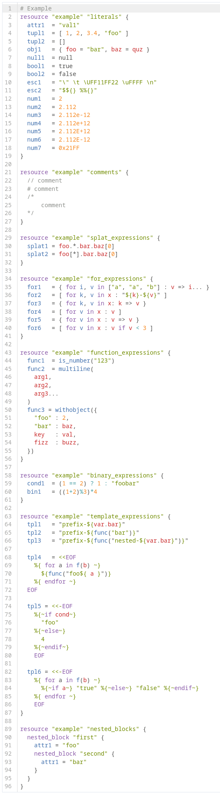

# codemirror-lang-hcl

[](https://www.npmjs.com/package/codemirror-lang-hcl)

This package implements [HCL](https://github.com/hashicorp/hcl) language support for the [CodeMirror](https://codemirror.net/6/) code editor.  

The [lezer](https://lezer.codemirror.net/) grammar is ported from [tree-sitter-hcl](https://github.com/tree-sitter-grammars/tree-sitter-hcl).

## Getting Started

### Installation

```bash
npm i codemirror-lang-hcl
```

### Usage

```javascript
import {EditorView} from '@codemirror/view';
import {EditorState} from '@codemirror/state';
import {hcl} from "codemirror-lang-hcl";

const state = EditorState.create({
	doc: 'my hcl code',
	extensions: [
		hcl(),
	]
});

const view = new EditorView({
	parent: document.querySelector('#editor'),
	state
});
```

## Example

This example is from [tree-sitter-hcl](https://github.com/tree-sitter-grammars/tree-sitter-hcl).

Theme: https://thememirror.net/tomorrow.


